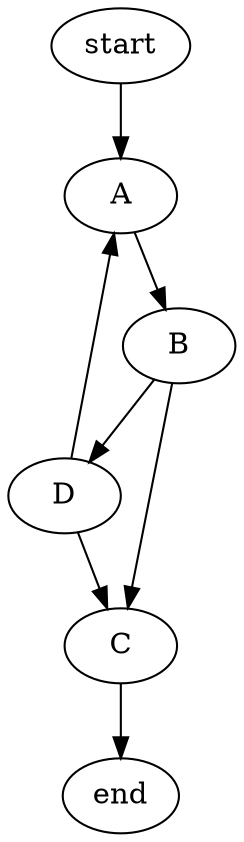
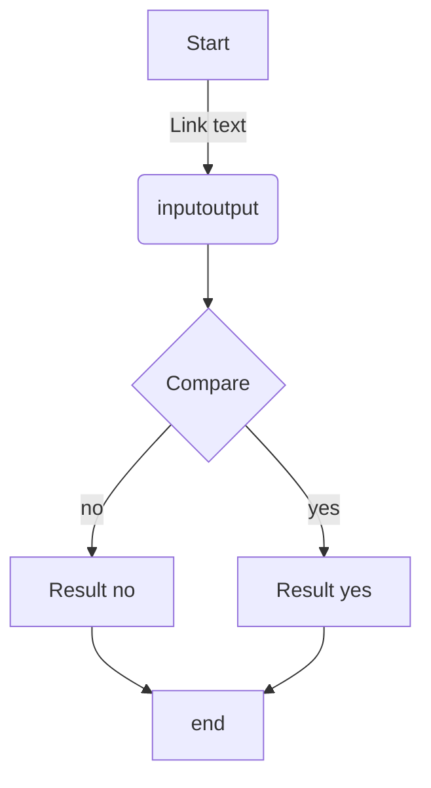

MarkDown一直以来都很受我喜欢。简洁的语法，高效的写作，强大的功能，注重内容表现，可以加入网页的标签，可以转换成网页、PDF等文件。总之MarkDown真的超适合做笔记。这里就介绍一下怎么用MarkDown在笔记中加入流程图。

## 准备编辑器

我使用的MarkDown编辑器是 `Atom文本编辑器` 。用来画流程图之前要先安装上一个扩展 `markdown-preview-enhanced` 。大家请自己到 Atom 的扩展管理中安装，不过有一些平台好像没办法安装这个扩展。安装完了扩展之后记得禁用 Atom 自带的 MarkDown 预览扩展。
安装完扩展之后，按 `Ctrl + Shift + M` 即可预览 MarkDown 文件。(因为这个快捷键和 Atom 自带的预览有冲突，所以建议禁用自带的预览)。新建一个文件扩展名为 `.md` 的文件，即可开始写笔记。

## 流程图的语法

Atom 的自带预览功能没有流程图和 LaTeX 支持所以一定要安装 `markdown-preview-enhanced` 。
MarkDown的流程图语法有这几种。

#### 第一种——dot

这一种很简单很易学，不过图标也都是一样的，不能排版得很漂亮。基本就是一个框框用箭头指向另一个框框。

    语法
    ```dot
    digraph G{
      start -> A
      A -> B
      B -> D
      D -> C
      D -> A
      B -> C
      C -> end
    }
    ```

预览



#### 第二种——mermaid

这一种比较复杂，但是也更美观。语法就是，一个标志指向另一个标志。字母后面的内容是要显示出来的内容，括号的种类决定了框的形状。字母前面的内容是链接箭头里面的内容。

    语法
    ```mermaid
    graph TD
    A[Start] -->|Link text| B(inputoutput)
    B --> C{Compare}
    C -->|yes| D[Result yes]
    C -->|no| E[Result no]
    E -->F
    D -->F[end]
    ```

预览



#### 第三种——flow

这一种比较复杂，但是可以控制的内容也比较多。而且方框的形状也更多。不过要细讲比较难，这里给一个别人的教程吧  http://blog.lisp4fun.com/2017/11/21/mermaiduse


    语法
    ```flow
    a=>start: start
    e=>end: end
    op1=>operation: My operation
    cond1=>condition: Sure?
    op2=>operation: test
    in1=>inputoutput: input|input
    in2=>inputoutput: inputnumber|input


    a(right)->op1->cond1
    cond1(yes)->op2->in1(right)->in2->e
    cond1(no)->op1
    ```

预览

```flow
a=>start: start
e=>end: end
op1=>operation: My operation
cond1=>condition: Sure?
op2=>operation: test
in1=>inputoutput: input|input
in2=>inputoutput: inputnumber|input


a(right)->op1->cond1
cond1(yes)->op2->in1(right)->in2->e
cond1(no)->op1
```


## 总结

MarkDown 用来做笔记真的很方便，建议大家可以了解一下。具体用哪一种流程图语法就看你觉得哪种比较方便了。


<br><br><br><br><br><br>
封面来自 https://www.nasa.gov/sites/default/files/styles/full_width/public/thumbnails/image/pia23824-16.jpg?itok=GUg8mm9B
