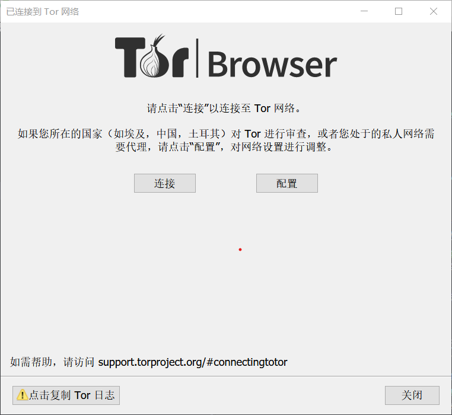
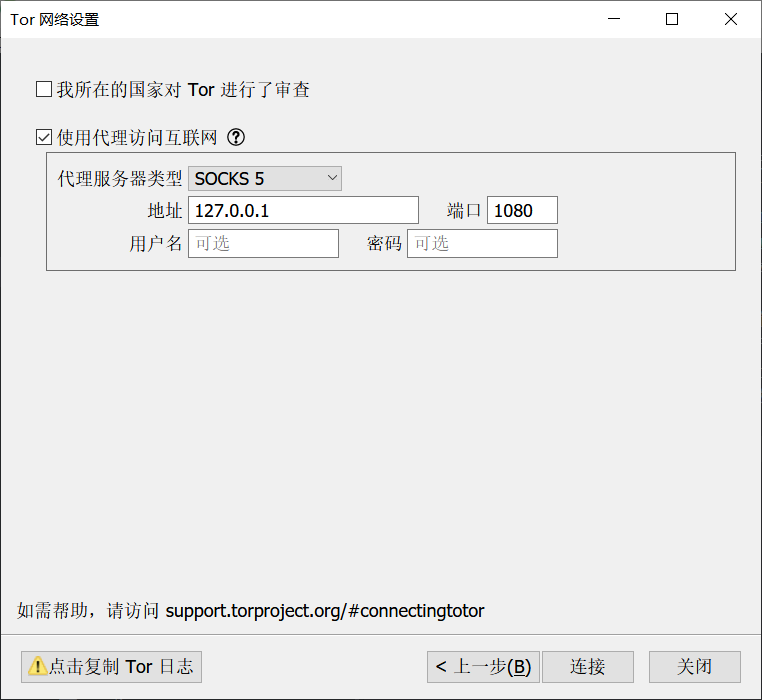
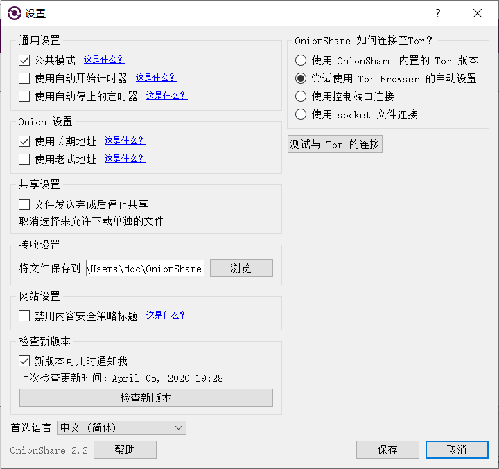

## OnionShare

`OnionShare`是我最近听说的一个匿名分享文件的工具。这个工具是一个开源软件。开发的目的是为了让人们可以避开政府监控和网络审查而分享重要的文件。这里是 `OnionShare` 的官网 [https://onionshare.org/](https://onionshare.org/) 。官网上面也有很多介绍，讲了这个工具的重要性和开发这个工具的原因。
网上有很多相关的教程了，不过主要都是英文的外国介绍。这里介绍一下在特色国家的使用教程。

1. 安装 `Tor` 。 `OnionShare` 是基于 `Tor` 实现匿名的，所以要先安装 `Tor` 。关于 `Tor` 以后再介绍一下，不过网上有很多教程大家可以自己去Google一下。先访问 `Tor` 官网 [https://www.torproject.org/download/download.html](https://www.torproject.org/download/download.html) 下载安装。不过这个网站在天朝以及被墙了，大家要先科学上网才行。
2. 配置一下 `Tor` 。因为 `Tor` 不方便监控，所以天朝政府早就封锁了。为了在天朝也能使用，大家需要先设置一下。这里可以使用网桥等方式，不过我使用了 `SSR` 代理。打开 `Tor` ，最新版的 `Tor` 将浏览器都设置得很安全了。除了代理这部分之外尽量不要修改其它地方了。之后就可以测试链接成功了没有。配置如下
 
 
3. 配置好Tor之后处理 OnionShare 。访问这个网站下载安装 OnionShare [https://onionshare.org/](https://onionshare.org/)
4. 配置OnionShare，打开OnionShare之后为其设置Tor代理配置。如下
 

## 使用OnionShare的方法和注意事项

上面这些配置都是针对特色国家的，非特色国家的人不用管直接看这里。
现在 `OnionShare` 有三个功能

1. 匿名发布文件
2. 匿名接收文件
3. 匿名建立静态网站

OnionShare被设计成了只能用Tor网络才能发布文件而且只能通过Tor网络访问。
这里介绍怎么用OnionShare建设一个静态匿名暗网网站。打开OnionShare之后先设置一下。如果你要建设一个长期的网站的话，建议选中长期地址，然后保存。点击添加。选中要添加的文件，这里选中你写好的网站首页。添加文件夹的时候如果打算把整个文件夹里面的东西都添加进去的话就点击一下选中就好。建设网站的时候要记得在每一个网站的目录下都加入一个写好的 `index.html` 的网页。这样打开的时候才能有一个首页。之后点击开始共享。这时会有一个Tor网络的网址。别人访问这个网址就可以打开你的这个网站了。在你的电脑上面还可以看到别人访问的次数。

      
封面来自 https://apod.nasa.gov/apod/image/2003/SaturnMoon_Sojuel_960.jpg
